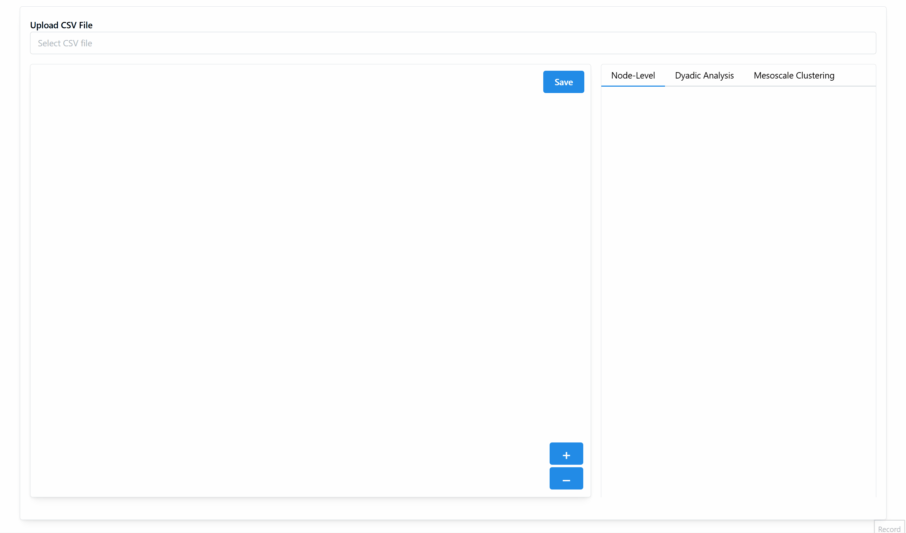

Dashboard
=========================

Overview
--------
The **Dashboard** APP provides the main dashboard for HINA, a tool designed for heterogeneous interaction network analysis in learning analytics. Its purpose is to enable users to upload CSV files, configure network parameters, construct and visualize networks, view analytical results, and export these results—all through an interactive web interface.

It serves as a comprehensive dashboard that integrates file upload, parameter configuration, network construction, interactive visualization, analytical result display, and data export functionalities. This streamlined workflow allows users to efficiently analyze heterogeneous interaction networks in learning analytics. 

Future enhancements can include additional analytical metrics and improved visualizations.

Main Functions and Purpose
----------------------------
The key functions and features of the Dashboard module include:

1. **File Upload**
    - **Purpose:** Allow users to import CSV files containing learning process data.
    - **Function:** `handleFileUpload` sends the selected file to the backend (at `/upload`) and retrieves the available groups and column names for further configuration.

2. **Parameter Configuration**
    - **Purpose:** Enable users to specify how the network should be built.
    - **Functions & Features:**
     - **Group Selection:** Choose a specific group from the dataset.
     - **Attribute Selection:** Select two attributes (columns) to define nodes and edges.
     - **Pruning Options:** Decide whether to apply no pruning or custom pruning (with additional parameters such as alpha and fixed degree settings).
     - **Layout Options:** Select the network layout (options include spring, bipartite, and circular).
     - **Clustering Option:** Input the number of clusters to be formed (can either be None or non-negative integer).

3. **Network Construction**
    - **Purpose:** Build the interaction network based on the uploaded data and selected parameters.
    - **Functions:**
     - `updateHinaNetwork`: Constructs the basic HINA network by sending parameters to the `/build-hina-network` endpoint.
     - `updateClusteredNetwork`: Constructs a clustered network by sending parameters to the `/build-cluster-network` endpoint.
    - **Outcome:** The network elements are updated and ready for constructing visualization.

4. **Network Visualization**
    - **Purpose:** Provide an interactive visual representation of the constructed network.
    - **Functionality:**
     - The CytoscapeComponent is used to render the network.
     - Zoom functionality is provided via the `zoomIn` and `zoomOut` functions.
     - The visualization is displayed in the left panel of the dashboard.
     - The network can be panned and zoomed using the CytoscapeJS interface.
     - The save button allows users to download the full and partial network as an image.

5. **Analytical Results Display**
    - **Purpose:** Analytical panel presents computed analytical metrics and results.
    - **Features:**
      - Results are organized into three tabs:
         - **Node-Level:** Displays Quantity & Diversity metrics for selected attributes.
         - **Dyadic Analysis:** Display significant edges and purned edges analysis.
         - **Mesoscale Clustering:** Display clustering results by our algorithm.
    - **Dynamic Update:** The analytical data updates automatically when the network is built or modified.

6. **Data Export**
    - **Purpose:** Allow users to export analytical results for offline analysis.
    - **Function:** Analytical panel compiles the Quantity & Diversity, Dyadic Analysis, Mesoscale Clustering data into seperate XLSX file and triggers its download.

Step-by-Step Workflow
----------------------
The following steps describe the typical workflow when using the Dashboard module:

1. **Step 1: Upload Data**
    - **Action:** Use the file input to select and upload a CSV file.
    - **Result:** The file is sent to the backend with available groups and column names are returned.

2. **Step 2: Configure Parameters**
    - **Action:** 
     - (Optional) Select a group to filter the data, if there is any predefined group in the data.
     - Choose Attribute 1 and Attribute 2 from the available columns.
     - (Optional) Set the pruning option, if “custom” is selected, configure the alpha value and fixed degree.
     - (Optional) Choose a layout (spring, bipartite, or circular) for network visualization, default as bipartite.
     - (Optional) Input a desired number of clusters for building cluster network.
    - **Result:** The interface is updated with the selected parameters.

.. image:: Figures/dashboard_demo_2.gif
   :alt: Dashboard Demo
   :align: center

3. **Step 3: Build the Network**
    - **Action:** 
     - Click on **"Update HINA Network"** to build the standard network.
     - Alternatively, click on **"Update Clustered Network"** to generate a network with mesoscale clustering.
    - **Result:** A POST request is sent to the appropriate backend endpoint, and the network elements are updated accordingly.

.. image:: Figures/dashboard_demo_3.gif
   :alt: Dashboard Demo
   :align: center

4. **Step 4: Visualize the Network**
    - **Action:** 
     - The constructed network is automatically displayed in the bottom left dashoboard panel.
     - Use the zoom buttons (+ and -) to adjust the view.
    - **Result:** Users can interact with the network visualization (pan, zoom, highlight, save).

.. image:: Figures/dashboard_demo_4.gif
   :alt: Dashboard Demo
   :align: center

5. **Step 5: View Analytical Results**
    - **Action:** 
     - Navigate between the tabs in the right panel to view different types of analysis:
       - **Node-Level Tab:** Shows a table of Quantity & Diversity metrics.
       - **Dyadic Analysis Tab:** Shows two tables of Significant Edges and Pruned Edges, respectively.
       - **Mesoscale Clustering Tab:** Shows a table of the clustering label results.
    - **Result:** Analytical data is presented to help interpret the network structure.

6. **Step 6: Export Results**
    - **Action:** Click the **Export Results** button to download the analytical results as a XLSX file.
    - **Result:** The XLSX file is generated and downloaded, allowing further analysis offline.

.. image:: Figures/dashboard_demo_5.gif
   :alt: Dashboard Demo
   :align: center