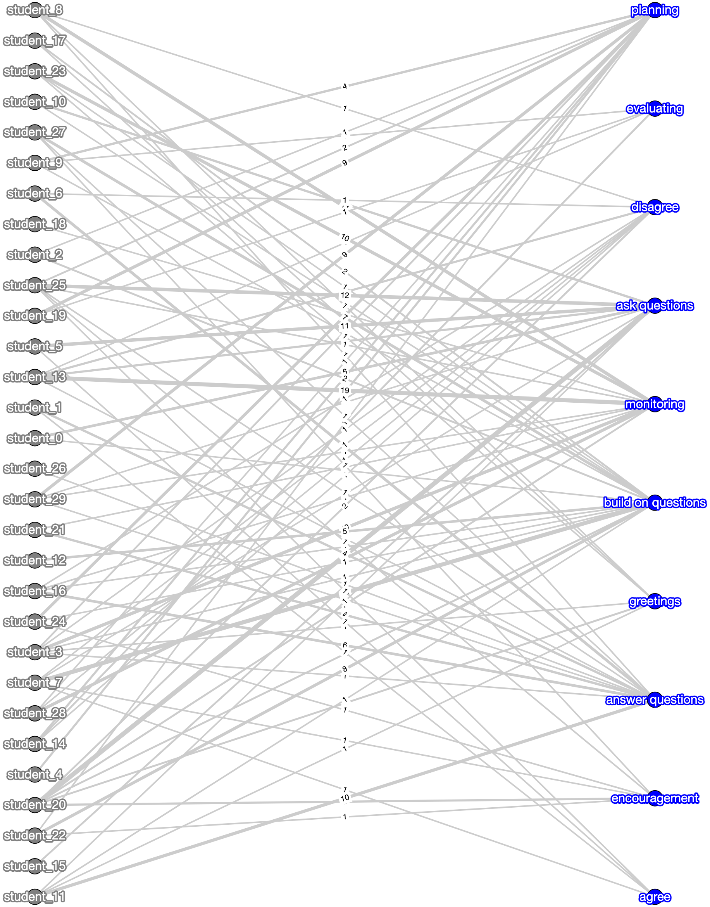
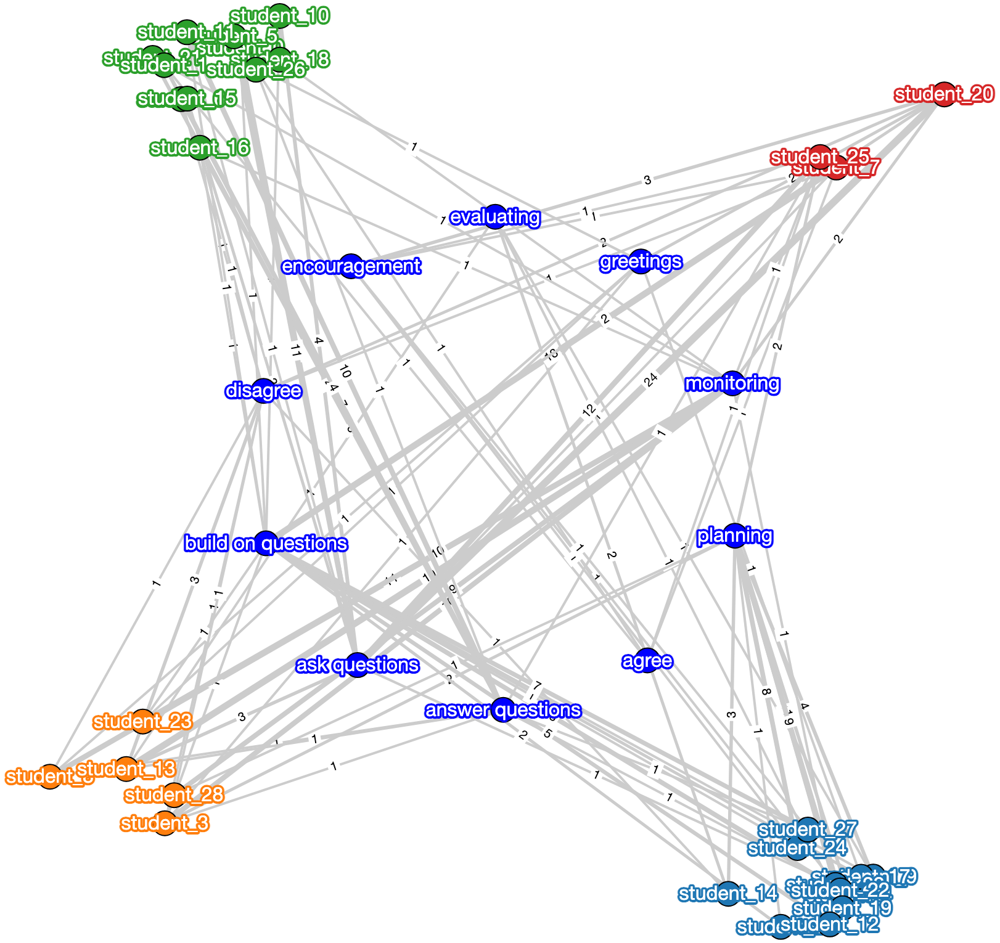

hina.visualization
+++++++++++++

Tutorial
========

The `visualization` module provides functions for visualizing heterogeneous interaction networks. Users can generate interactive plots that project bipartite networks onto specified layouts, optionally filter nodes based on group attributes, and display community structures with distinct node colors and positions.

Currently, the module contains the `network_visualization.py` file, which includes:

- `plot_hina`: Visualizes a bipartite network with customizable layout, optional node filtering, and optional edge pruning.
- `plot_bipartite_clusters`: Visualizes a bipartite network with community structure by arranging nodes in a circular layout with colors and shapes that reflect cluster memberships.

.. list-table:: Functions
   :header-rows: 1

   * - Function
     - Description
   * - `plot_hina(B, layout='bipartite', group_name=[None, None], pruning_kwargs=None, NetworkX_kwargs=None) <#plot-hina>`_
     - Visualizes a bipartite network with customizable layout, optional node filtering, and edge pruning.
   * - `plot_bipartite_clusters(G, noise_scale=3, radius=20., encode_labels=False, node_labels=True, edge_labels=False, scale_nodes_by_degree=False, node_scale=2000., node_kwargs={'edgecolors':'black'}, edge_kwargs={'edge_color':'black'}) <#plot-bipartite-clusters>`_
     - Visualizes a bipartite network with community structure; nodes are arranged in a circular layout according to cluster assignments.

Reference
---------

.. _plot-hina:

.. raw:: html

   

       function plot_hina(B, layout='bipartite', group_name=[None, None], pruning_kwargs=None, NetworkX_kwargs=None)
       <a href="../Code/network_visualization.html#plot-hina" class="source-link">[source]</a>
   

**Description**:
Visualizes a bipartite network using a specified layout. The function optionally prunes edges based on statistical significance if pruning parameters are provided and can filter nodes by a specified group attribute.

**Parameters**:

.. raw:: html

   

       (B, layout='bipartite', group_name=[None, None], pruning_kwargs=None, NetworkX_kwargs=None)
   

   <ul class="parameter-list">
       <li>B: A NetworkX graph representing the bipartite network to be visualized.</li>
       <li>layout: A string specifying the layout for node positioning. Options include <code>'bipartite'</code>, <code>'spring'</code>, and <code>'circular'</code>. Default is <code>'bipartite'</code>.</li>
       <li>group_name: A list of two elements, where the first is the node attribute name (e.g., <code>'group'</code>) and the second is the specific value to filter by (e.g., <code>'Group 1'</code>). Default is <code>[None, None]</code>, meaning all nodes are included.</li>
       <li>pruning_kwargs: Optional dictionary of parameters for pruning edges using statistical significance testing. Default is <code>None</code> (no pruning).</li>
       <li>NetworkX_kwargs: Optional dictionary of additional keyword arguments for customizing the NetworkX visualization. Default is <code>None</code>.</li>
   </ul>

**Returns**:
  - **None**: Displays the bipartite network visualization.

.. _plot-bipartite-clusters:

.. raw:: html

   

       function plot_bipartite_clusters(G, noise_scale=3, radius=20., encode_labels=False, node_labels=True, edge_labels=False, scale_nodes_by_degree=False, node_scale=2000., node_kwargs={'edgecolors':'black'}, edge_kwargs={'edge_color':'black'})
       <a href="../Code/network_visualization.html#plot-bipartite-clusters" class="source-link">[source]</a>
   

**Description**:
Visualizes a bipartite network with community structure by arranging nodes in a circular layout. Nodes in the first set are positioned around community centroids while nodes in the second set are arranged inside the circle. Community labels are indicated through distinct node colors and shapes.

**Parameters**:

.. raw:: html

   

       (G, noise_scale=3, radius=20., encode_labels=False, node_labels=True, edge_labels=False, scale_nodes_by_degree=False, node_scale=2000., node_kwargs={'edgecolors':'black'}, edge_kwargs={'edge_color':'black'})
   

   <ul class="parameter-list">
       <li>G: A NetworkX graph representing the bipartite network with weighted edges.</li>
       <li>noise_scale: A float controlling the dispersion of nodes in the first set around their community centroids. Default is <code>3</code>.</li>
       <li>radius: A float defining the radius for positioning community centers. Default is <code>20</code>.</li>
       <li>encode_labels: A boolean indicating whether to encode node labels into unique identifiers. Default is <code>False</code>.</li>
       <li>node_labels: Specifies whether to display labels for nodes. This can be <code>True</code> to label all nodes (or a string such as <code>'Both Sets'</code> for customized labeling). Default is <code>True</code>.</li>
       <li>edge_labels: A boolean indicating whether to display edge weights as labels. Default is <code>False</code>.</li>
       <li>scale_nodes_by_degree: A boolean indicating whether to scale node sizes proportionally to their weighted degree. Default is <code>False</code>.</li>
       <li>node_scale: A float controlling the average node size. Default is <code>2000</code>.</li>
       <li>node_kwargs: A dictionary of additional keyword arguments for customizing node appearance. Default is <code>{'edgecolors': 'black'}</code>.</li>
       <li>edge_kwargs: A dictionary of additional keyword arguments for customizing edge appearance. Default is <code>{'edge_color': 'black'}</code>.</li>
   </ul>

**Returns**:
  - **None**: Displays the network visualization with community grouping.

Demo
====

Example Code
------------

This example demonstrates how to visualize a heterogeneous interaction network and its community structure.

**Step 1: Import necessary libraries**

.. code-block:: python

    import pandas as pd
    from hina.construction import get_bipartite
    from hina.visualization import plot_hina, plot_bipartite_clusters

**Step 2: Load the example dataset**

.. code-block:: python

    df = pd.read_excel("example_dataset.xlsx")

**Step 3: Construct the bipartite network representation**

.. code-block:: python

    B = get_bipartite(df,student_col='student id (student_col)', object_col='codes (obj1_col)', attr_col='code_categories (obj_attribute_col)', group_col='group (group_col)')

**Step 4: Visualize the bipartite network for all groups**

.. code-block:: python

    plot_hina(B, layout='bipartite', group_name = ['group (group_col)', None], pruning_kwargs=None, NetworkX_kwargs=None)

**Step 5: Visualize bipartite clustering network with an automatically inferred number of communities**

.. code-block:: python

    plot_bipartite_clusters(B)

Example Output
--------------

Bipartite network of students and tasks for all groups.

Bipartite clustering network with automatically inferred communities.

Paper Source
============

If you use these visualization functions in your work, please cite:

Feng, S., Gibson, D., & Gasevic, D. (2025). Analyzing students' emerging roles based on quantity and heterogeneity of individual contributions in small group online collaborative learning using bipartite network analysis. Journal of Learning Analytics, 12(1), 253–270.